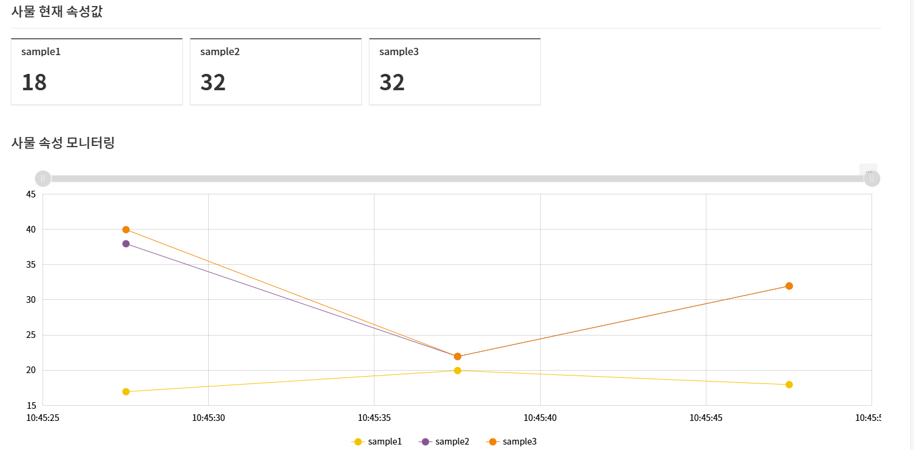

JAVA SDK SAMPLE
=

## 1. 개요

**Java SDK**는 사물에서 **Brightics IoT 사물 관리 기능, Open API** 등 플랫폼 연계 기능을 쉽게 개발하도록 제공하는 JAVA 프로그래밍 라이브러리 입니다.  
사물 개발자가 본 샘플코드를 통해 쉽고 간편하게 사물과 IoT 플랫폼을 연결하고 데이터 통신을 수행할 수 있도록 하는것이 목적입니다.

## 2. 개발환경 구성하기

개발환경 구성은 아래 매뉴얼 링크를 클릭하여 진행 해주시기 바랍니다.
- [samsung JAVA SDK 매뉴얼 링크](https://www.samsungsdsbiz.com/help/brighticsiot/core/V3/3-0/KR/sdk/using_java_sdk#development_specification_for_java_sdk)  
  ※ 최소사양 (java 1.8 이상, Maven 3.0 이상) 권장 하드웨어 (라즈베리 파이 3 이후 모델)

## 3. 샘플 활용하기

삼성에서 제공해 주는 SDK를 활용하여 PoC 환경에서 동작할 수 있도록 샘플 코드를 수정하였습니다.  
아래 링크를 클릭 하여 가이드 문서를 내려받아 'ITA 인증 방식으로 연결 및 활성화' 부분을 확인해주세요.
- [가이드 문서 다운로드](./guide/SDK_GUIDE_JAVA.hwp)

### App.java
<pre>
//biot-device-sdk-java-sample/src/main/java.com/sample/app/App.java

package com.sample.app;

import com.google.gson.JsonObject;
import com.sds.iot.sdk.IotClient;
import com.sds.iot.sdk.auth.ita.ItaDirectAuth;

/**
 * Sample App
 * ITA 인증 방법으로 IoT 서버와 Connect 하는 예제
 * 

 * -- 설명
 * PoC 접속 후 사물 > 사물관리 메뉴에서 생성한 사물을 검색하여 하단의 정보를 입력해주세요.
 * 입력된 정보를 통해 인증 객체를 생성하고 제공되는 SDK의 IoTClient 클래스를 통해 사물객체를 받습니다.
 * 해당 사물객체를 연결 및 활성화를 하여 데이터를 받을 수 있는 상태로 전환합니다.
 * 수집데이터 전송을 위해 해당 사물의 속성명과 속성타입에 맞는 값을 입력하여 json형식의 데이터를 생성합니다.
 * PoC와 연결된 사물객체를 통해 데이터를 전송합니다.
 */
public class App {
    public static void main(String[] args) {
        try {
            // authCode - ita 장비 인증정보 입니다.  등록한 사물의 사물정보 화면에서 정보를 입력해주세요.
            String siteId = "C000000037";
            String thingName = "SDK_SAMPLE_MODEL.0625";
            String authCode = "373f8d68055caf9e";

            ItaDirectAuth auth = new ItaDirectAuth(authCode);
            IotClient client = new IotClient(auth, siteId, thingName, "biot_client.properties");

            // PoC에 등록된 사물에 연결합니다.
            client.connect();

            // 연결한 사물을 활성화합니다.
            client.activateThing("SDK_SAMPLE_MODEL", "0625");

            // 데이터 전송부분입니다.
            try {
                // 전송할 데이터를 Json형식으로 만들어줍니다.
                JsonObject data = new JsonObject();
                data.addProperty("temperature", 1.5);
                data.addProperty("humidity", 2.5);
                
                // Json형식으로 만든 데이터를 1회 전송 합니다.
                client.sendAttributes("Basic-AttrGroup", data.toString());
            } catch (Exception e) {
                e.printStackTrace();
            }
        } catch (Exception e) {
            e.printStackTrace();
        }
    }
}
</pre>

### biot_client.properties
<pre>

apiServerAddr=https://poc-brighticsiot.samsungsds.com
serverAddr=ssl://poc-brighticsiot.samsungsds.com:8009

retry.connectRetryMaxCount=3
retry.connectRetryDelayRandomRange=0

mqtt.connectionTimeout=3

######################################################

##### when using mutual(2-way) tls
#MUTUAL_TLS_CRT=Test.002.crt
#MUTUAL_TLS_KEY=Test.002.key
#KEYSTORE_PASSWORD=insator1!
#KEYSTORE_KEY_PASSWORD=insator1!

##### when using private certification 
TRUST_KEYSTORE_PUBLIC_YN=true
TRUST_KEYSTORE=
TRUST_KEYSTORE_PASSWORD=

######################################################
</pre>

### 전송한 샘플데이터는 PoC 사물 속성 모니터링에서 확인할 수 있습니다.

## 4. 참고사항
- 인증 방식 중 ITA만 샘플 코드를 작성하였습니다.
- 인증에는 사이트 아이디, 장비별 인증코드, 사물 명이 필수 파라미터이며, 인증에 아이디/패스워드는 사용하지 않으므로 제공하지 않습니다. 